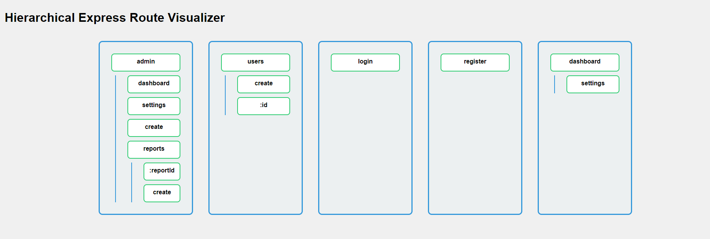
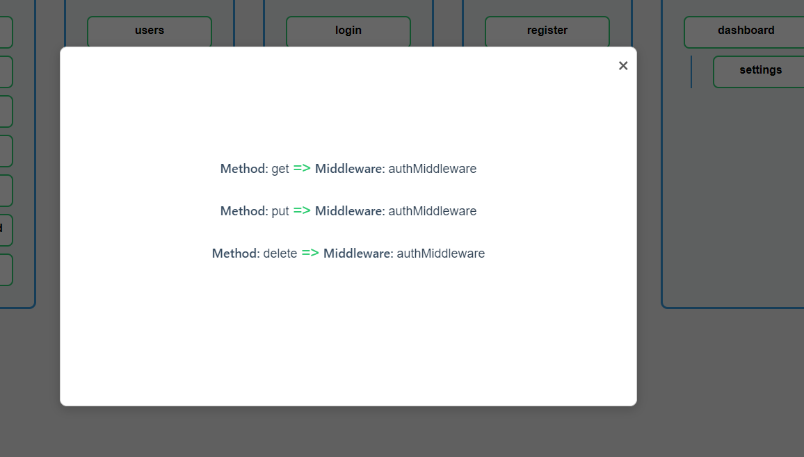

# Express Route Visualizer

Express Route Visualizer is a powerful npm package that generates a visual representation of your Express.js application routes. It creates an interactive HTML file that displays your routes in a hierarchical tree structure, making it easier to understand and debug your Express application's routing system.

## Features

- Generates a hierarchical visualization of Express routes
- Displays HTTP methods and associated middlewares for each route
- Interactive UI with expandable/collapsible nodes
- Popup details for each route showing methods and middlewares
- Easy integration with existing Express applications

## Installation

Install the package using npm:

```bash
npm install expres-route-visualizer
```

## Usage

1. Import the package in your Express application:

```javascript
const express = require('express');
const generateHTML = require("expres-route-visualizer");
const app = express();
```

2. Define your routes and middlewares as usual:

```javascript
app.get('/', (req, res) => res.send('Home'));
app.get('/about', logMiddleware, (req, res) => res.send('About page'));
// ... more routes
```

3. After defining all your routes, call the `generateHTML` function:

```javascript
generateHTML(app);
```

4. Run your Express application. The visualizer will generate an HTML file in the `generate` folder of your project root.

5. Open the generated `hierarchical.html` file in your browser to view the route visualization.

## Example

Here's a basic example of how to use Express Route Visualizer:

```javascript
const express = require('express');
const generateHTML = require("expres-route-visualizer");
const app = express();

// Middlewares
const authMiddleware = (req, res, next) => {
    console.log('Auth middleware');
    next();
};

const logMiddleware = (req, res, next) => {
    console.log(`Request to: ${req.path}`);
    next();
};

const timingMiddleware = (req, res, next) => {
    console.time('Response time');
    res.on('finish', () => console.timeEnd('Response time'));
    next();
};

// Routes

// Home route
app.get('/', (req, res) => res.send('Home'));

// Admin routes
app.get('/admin/dashboard', authMiddleware, timingMiddleware, (req, res) => res.send('Admin Dashboard'));
app.get('/admin/settings', authMiddleware, logMiddleware, (req, res) => res.send('Admin Settings'));
app.post('/admin/create', authMiddleware, (req, res) => res.send('Create admin'));

// Admin report routes (hierarchique sous admin)
app.get('/admin/reports', authMiddleware, (req, res) => res.send('Report list'));
app.get('/admin/reports/:reportId', authMiddleware, (req, res) => res.send(`Get report ${req.params.reportId}`));
app.post('/admin/reports/create', authMiddleware, logMiddleware, (req, res) => res.send('Create report'));

// User routes
app.get('/users', authMiddleware, (req, res) => res.send('User list'));
app.post('/users/create', authMiddleware, logMiddleware, (req, res) => res.send('Create user'));
app.get('/users/:id', authMiddleware, (req, res) => res.send(`Get user ${req.params.id}`));
app.put('/users/:id', authMiddleware, (req, res) => res.send(`Update user ${req.params.id}`));
app.delete('/users/:id', authMiddleware, (req, res) => res.send(`Delete user ${req.params.id}`));

// Login and register routes
app.post('/login', logMiddleware, (req, res) => res.send('Login user'));
app.post('/register', (req, res) => res.send('Register user'));

// Other hierarchies for testing
app.get('/dashboard', authMiddleware, (req, res) => res.send('Dashboard'));
app.get('/dashboard/settings', authMiddleware, (req, res) => res.send('Dashboard Settings'));

// Generate route visualization
generateHTML(app);

// Start the server
app.listen(3010, () => console.log('Server running on port 3010'));

```

## Output

The generated HTML file will display a tree structure of your routes, with each node representing a route segment. Clicking on a node will show a popup with details about the route's HTTP methods and associated middlewares.





## Contributing

Contributions are welcome! Please feel free to submit a Pull Request.

## License

This project is licensed under the MIT License.

## Author

DAHHOU Ilyas
